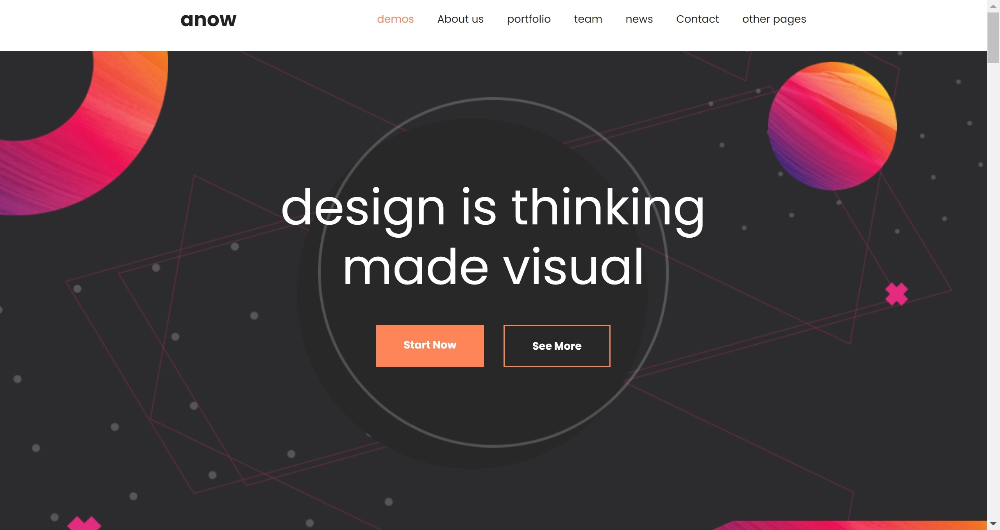
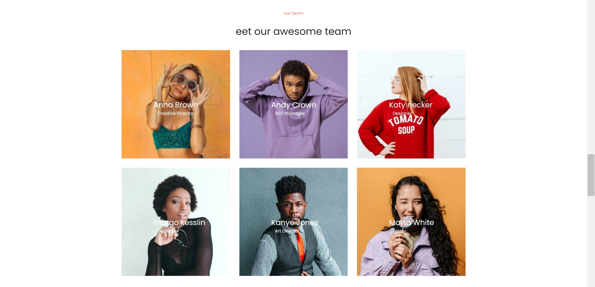
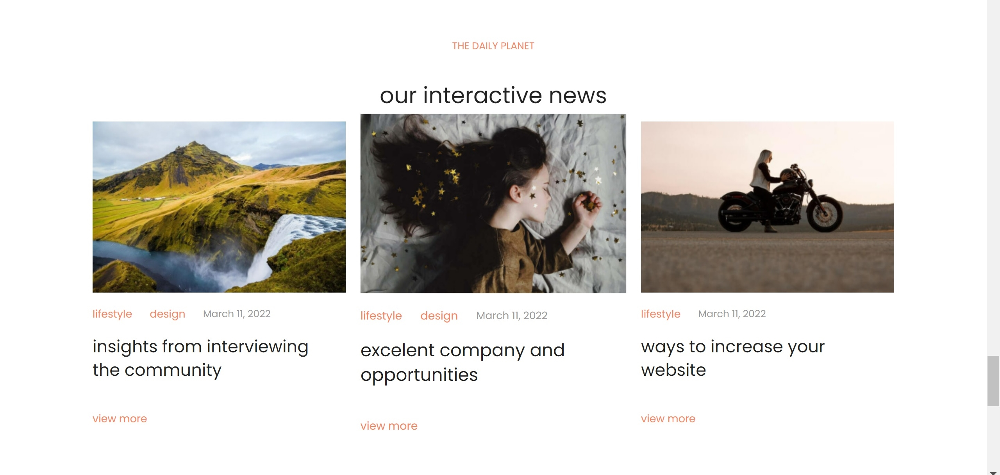

# anow

> ___anow___ - adaptive site that I made for practice

[view in browser](https://annazakavova.github.io/anow/)

```
language -english
``` 

* __created whith__
	* HTML
	* SCSS
	* JS

* __Acknowledgments__
	I don’t remember where I found the layout, but thanks to the designers for their work. Layout [Figma](https://www.figma.com/file/MctWglV69DYFRjRjHUGaZd/Anow?node-id=0%3A1)

```
some photos
``` 


